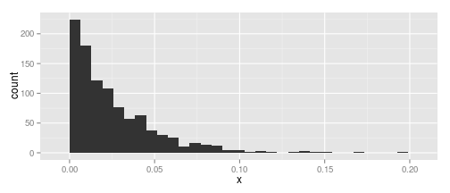
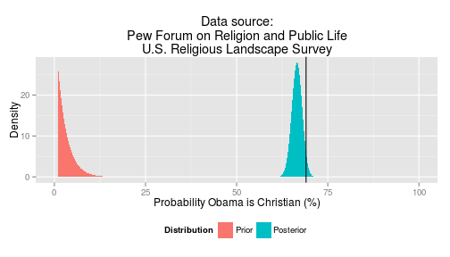
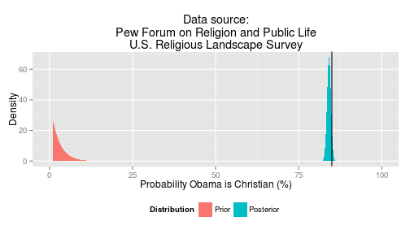
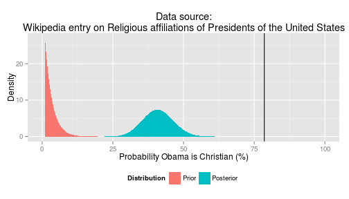

Probability of Obama being Christian
====================================

Motivation
----------
This [article](http://caffertyfile.blogs.cnn.com/2012/06/25/what-does-it-mean-if-nearly-half-of-americans-cant-name-president-obamas-religion/) by [Jack Caferty](http://caffertyfile.blogs.cnn.com/) stated:
> Nearly half of Americans can't name President Obama's religion.
>
> A new Poll shows only 34% of those surveyed correctly say that Obama is a Christian.

I will show that if we apply Bayesian thinking, then we can come up with a reasonable guess as to Obama's religious affiliation given some data, and how this data may influence preconceived beliefs about his affiliation. In other words, **I'll come up with data-based posterior probability that Obama is a Christian.**

Methods
-------
I will use [R](http://www.r-project.org/) to do the analysis (`R version 2.15.1 (2012-06-22)`). I will use the [Bolstad](http://cran.r-project.org/web/packages/Bolstad/) package to compute Bayesian posterior probabilities. Specifically, I'll use the [binobp](http://rgm2.lab.nig.ac.jp/RGM2/func.php?rd_id=Bolstad:binobp) function for binomial sampling with a beta prior. Use [ggplot](http://ggplot2.org/) to plot the posteriors.


```r
require(Bolstad, quietly = TRUE)
require(ggplot2, quietly = TRUE)
```


Define a function used make the data frame to plot the prior and posterior distributions using [ggplot](http://ggplot2.org/).

```r
makeGGdata <- function(objBinobp) {
    x <- objBinobp$pi * 100
    prior <- objBinobp$prior
    post <- objBinobp$posterior
    labPrior <- rep("Prior", length(x))
    labPost <- rep("Posterior", length(x))
    dfPrior <- data.frame(type = labPrior, x = x, prob = prior)
    dfPost <- data.frame(type = labPost, x = x, prob = post)
    rbind(dfPrior, dfPost)
}
```


Prior
-----
I'll use a beta prior, the conjugate prior for the binomial distribution. The case where the prior is noninformative is not very interesting (i.e., the posterior probability that Obama is a Christian is based solely on the data). So I'll use an informative prior that handicaps Obama's Christianity.

```r
a <- 1
b <- 40
```

To give an idea of what a $\beta$(`1`, `40`) looks like, here is a random sample of 1,000 draws.

```r
x <- rbeta(1000, a, b)
qplot(x)
```

```
## stat_bin: binwidth defaulted to range/30. Use 'binwidth = x' to adjust
## this.
```

 

```r
summary(x)
```

```
##    Min. 1st Qu.  Median    Mean 3rd Qu.    Max. 
## 0.00005 0.00713 0.01800 0.02550 0.03620 0.19300
```

50% of the draws are below `1.7988`%. I.e., before looking at any data, my belief that Obama is a Christian is really low, in the `1.7988`% neighborhood.


Data on mixed race Christians
-----------------------------

Use data from the [U.S. Religious Landscape Survey](http://religions.pewforum.org/) by the Pew Forum on Religion and Public Life.

Chapter 3 contains data on relgious affiliation by demographic characteristics. The total number of people in the survey who reported a race category (n=35,101) is found in this [document](http://religions.pewforum.org/pdf/comparison-Racial%20and%20Ethnic%20Composition%20of%20Religious%20Traditions.pdf). This document also has data on the percentage of the total sample size who are other or mixed race (3%). The percentage of respondents by race category reporting to be Christian (69% for other/mixed race) is found in this [document](http://religions.pewforum.org/pdf/report-religious-landscape-study-chapter-3.pdf).

Set up the data.

```r
nTotal <- 35101
n <- round(nTotal * 0.03)
x <- round(n * 0.69)
```

Call [binobp](http://rgm2.lab.nig.ac.jp/RGM2/func.php?rd_id=Bolstad:binobp) using a beta prior. 

```r
postMixed <- binobp(x, n, a = a, b = b)
```

```
## Posterior Mean           :  0.6654479 
## Posterior Variance       :  0.0002033 
## Posterior Std. Deviation :  0.0142588 
## 
## Prob.	Quantile 
## ------	---------
## 0.005	0.6281828
## 0.01	0.6318514
## 0.025	0.6372212
## 0.05	0.641822
## 0.5	0.6655488
## 0.95	0.6887298
## 0.975	0.6931016
## 0.99	0.6981552
## 0.995	0.7015777
```

Plot prior and posterior distributions. The vertical line shows the proportion of Christians of the dataset.

```r
df <- makeGGdata(postMixed)
ggplot(df, aes(x, prob, fill = type)) + geom_area() + scale_fill_hue("Distribution") + 
    scale_x_continuous("Probability Obama is Christian (%)", limits = c(0, 100)) + 
    scale_y_continuous("Density") + geom_vline(xintercept = (x/n * 100)) + labs(title = "Data source:\nPew Forum on Religion and Public Life\nU.S. Religious Landscape Survey") + 
    theme(legend.position = "bottom")
```

 

**Conclusion:** Given that my prior belief that Obama is a Christian is almost zero, in light of the data from the Pew Forum on Religion and Public Life [U.S. Religious Landscape Survey](http://religions.pewforum.org/) on the proportion of mixed race Christians, my revised belief that Obama is a Christian is `66.5`% $\pm$`1.4`%.


Data on African-American Christians
-----------------------------------

What happens when you forget about the fact that Obama is mixed race and just think of him as "the black president"?

Again, use data from the [U.S. Religious Landscape Survey](http://religions.pewforum.org/) by the Pew Forum on Religion and Public Life. The percentage of African-Americans in the sample is 11%. The number of African-Americans who are Christian is 85%.

Set up the data.

```r
nTotal <- 35101
n <- round(nTotal * 0.11)
x <- round(n * 0.85)
```

Call [binobp](http://rgm2.lab.nig.ac.jp/RGM2/func.php?rd_id=Bolstad:binobp) using a beta prior. 

```r
postAfrAm <- binobp(x, n, a = a, b = b)
```

```
## Posterior Mean           :  0.8413634 
## Posterior Variance       :  3.42e-05 
## Posterior Std. Deviation :  0.0058478 
## 
## Prob.	Quantile 
## ------	---------
## 0.005	0.8259755
## 0.01	0.8275047
## 0.025	0.8297377
## 0.05	0.831646
## 0.5	0.8414217
## 0.95	0.8508819
## 0.975	0.8526577
## 0.99	0.8547076
## 0.995	0.8560942
```

Plot prior and posterior distributions. The vertical line shows the proportion of Christians of the dataset.

```r
df <- makeGGdata(postAfrAm)
ggplot(df, aes(x, prob, fill = type)) + geom_area() + scale_fill_hue("Distribution") + 
    scale_x_continuous("Probability Obama is Christian (%)", limits = c(0, 100)) + 
    scale_y_continuous("Density") + geom_vline(xintercept = (x/n * 100)) + labs(title = "Data source:\nPew Forum on Religion and Public Life\nU.S. Religious Landscape Survey") + 
    theme(legend.position = "bottom")
```

 

**Conclusion:** Given that my prior belief that Obama is a Christian is almost zero, in light of the data from the Pew Forum on Religion and Public Life [U.S. Religious Landscape Survey](http://religions.pewforum.org/) on the proportion of African-American Christians, my revised belief that Obama is a Christian is `84.1`% $\pm$`0.6`%.


Data on past presidents
-----------------------
What happens to my prior belief on Obama's probability of being Christian when I consider the Christianity of past presidents?

Source: Wikipedia entry on [Religious affiliations of Presidents of the United States](http://en.wikipedia.org/wiki/Religious_affiliations_of_Presidents_of_the_United_States). I will *not* count irreligious as Christian. 
> There are some presidents for which there is little evidence as to the importance of religion in their lives. For example, almost no evidence exists for Monroe's personal religious beliefs, though this may be the result of the destruction of most of his personal correspondence, in which religious sentiments may have been recorded.
>
> Franklin Steiner lists four presidents as "not affiliated" and six others as "religious views doubtful":[9]

These presidents are:
* James Madison
* James Monroe
* Martin Van Buren
* William Henry Harrison
* John Tyler
* Zachary Taylor
* Andrew Johnson
* Rutherford B. Hayes
* Chester Arthur

This will result in a conservative estimate on Obama's Christian afiliation.

Set up the data. Obama is the 43rd POTUS, so there were 42 before him. Nine were not Christian (see above).

```r
n <- 42
x <- n - 9
```

Call [binobp](http://rgm2.lab.nig.ac.jp/RGM2/func.php?rd_id=Bolstad:binobp) using a beta prior. 

```r
postPres <- binobp(x, n, a = a, b = b)
```

```
## Posterior Mean           :  0.4096386 
## Posterior Variance       :  0.002879 
## Posterior Std. Deviation :  0.0536562 
## 
## Prob.	Quantile 
## ------	---------
## 0.005	0.2769859
## 0.01	0.2889171
## 0.025	0.3068261
## 0.05	0.3225728
## 0.5	0.4089093
## 0.95	0.4991958
## 0.975	0.5165776
## 0.99	0.5367247
## 0.995	0.550381
```

Plot prior and posterior distributions. The vertical line shows the proportion of Christians of the dataset.

```r
df <- makeGGdata(postPres)
ggplot(df, aes(x, prob, fill = type)) + geom_area() + scale_fill_hue("Distribution") + 
    scale_x_continuous("Probability Obama is Christian (%)", limits = c(0, 100)) + 
    scale_y_continuous("Density") + geom_vline(xintercept = (x/n * 100)) + labs(title = "Data source:\nWikipedia entry on Religious affiliations of Presidents of the United States") + 
    theme(legend.position = "bottom")
```

 

**Conclusion:** Given that my prior belief that Obama is a Christian is almost zero, in light of the data from [Religious affiliations of Presidents of the United States](http://en.wikipedia.org/wiki/Religious_affiliations_of_Presidents_of_the_United_States) on the proportion of Christian U.S. Presidents, my revised belief that Obama is a Christian is `41`% $\pm$`5.4`%.


Concluding thoughts
-------------------
Based on the religious affiliation of Obama's demographic, one would have better than 1:1 odds of guessing that he is a Christian, despite an overwhelming prior belief that he is not. It is interesting, however, that with the same overwhelming prior belief that one would reach a different conclusion as to Obama's religious affiliation when considering the affiliations of U.S. presidents before him.
